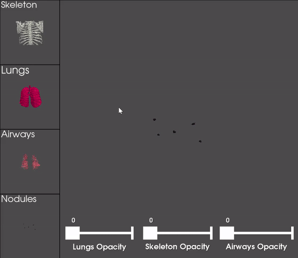

# 3D Lung Nodule Detection and Reconstruction Lung Nodule Detection

Nearly a quarter of all cancer deaths are caused by lung cancer, which is the most common cancer worldwide. Early detection is essential for effective therapy, but because of their size and location, lung nodules can be difficult to spot. The goal of this study is to increase the precision and effectiveness of lung and airway reconstruction, lung nodule detection, and oncologists' ability to diagnose patients.

## Overview
We design a 3D reconstruction pipeline for lung anatomy and possibly malignant tumors using cutting-edge computer vision and machine learning approaches. 3D reconstruction, feature extraction, image pre-processing, model training, and validation, and are some of the processes that make up the pipeline.

## Computer Vision
In CT scans, our computer vision component recognizes and categorizes the lung anatomy. In order to prepare the data for subsequent processing, this stage uses 2D pre-processing techniques like: filtering, image normalization, and segmentation.

## Machine Learning
For nodule segmentation and false-positive reduction, we use 3D Deep Convolution Neural Networks (DCNN) trained in multi-head manner. These models are made to precisely locate lung nodules, offering a strong starting point for future investigation.

## 3D reconstruction
The detailed 3D models of the airways, lungs, skeleton, and possibly nodules produced by the 3D reconstruction module can be examined for indications of malignancy based on their size, shape, position, and closeness to airways. In this stage, accurate models of the lung and airways are created using computer graphics and 3D reconstruction algorithms.

This polyhedron demo is rendered on GPU and is real-time.

 

## Getting Started
To get started with the project, please follow the installation and usage instructions provided in the documentation.

### License
This project is licensed under the MIT License.

## References
[1] [Cancer Statistics](https://www.cancer.org/healthy/cancer-causes/general-info/lifetime-probability-of-developing-or-dying-from-cancer.html)

Relevant citations for computer vision and machine learning techniques will be added soon.

## Contributor:
    Bardh Rushiti (bardhrushiti@gmail.com)
